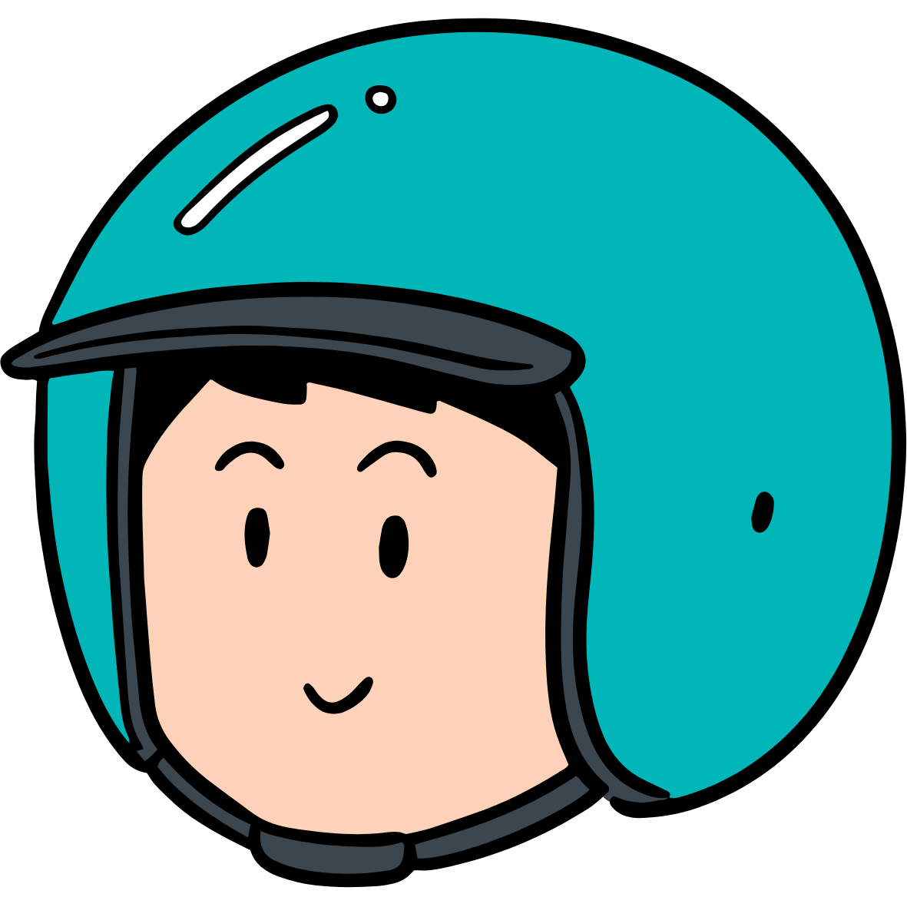

## Hi, I'm Zong Xin 👋
- **CS graduate 2025 (NUS)** | Building user-friendly products that solve real problems.  
- Interested in frontend/backend development, full-stack development, UI/UX, and designing practical solutions.

- - -

### 💼 Work Experience
*Some project links point to archived or client-managed versions.*

- **Xtremax** – Associate Full Stack Developer Full-time (2026) | ASP.NET, CI/CD, AWS, MySQL, System Engineering
- **Makino Asia** – Software Developer Intern (2025) | [Contributions to JMV2](https://drive.google.com/file/d/19Z0GgsIsuUSng1fEoz0mKycrG0DKOY3L/view?usp=drive_link) | Angular, Design Thinking, ASP.NET, SSMS, REST APIs, Agile
- **Elves Lab** – Software Developer Intern (2021–2022) | [MDADA](http://www.webdesigning.com.sg/project/Mdada/) | [Smile Dental](https://www.smiledental.sg/) | [MNDA](https://www.mnda.org.sg/) | HTML, CSS, JavaScript, ASP.NET, MySQL
- **The Signature Patisserie** – Software Developer Freelance (2019–2022) | [The Signature Patisserie](https://thesignaturepatisserie.com/) | HTML, CSS, Bootstrap, JavaScript, Node.js, MongoDB, REST APIs, Hosting → WooCommerce → Shopify

- - -

### 🌱 Personal Project
**&nbsp;&nbsp;GoHomeClub**  

A motorcycle booking platform that helps riders discover and book trips, built with React.js and Next.js. Responsible for full-stack development, UI/UX design, and all key functionality.
- **Single-Page Application (SPA):** [Admin Portal](http://go-home-club-spa.vercel.app/) to manage trips, bookings, and settings. Built with React.js, using React Router (routing), Context API (ui state), React Query (remote state), Styled Components (styling), and Supabase (backend/storage).
- **Multi-Page Application (MPA):** [Booking Website](https://gohomeclub.sg) showcasing trips and allowing users to explore and book rides. Built with Next.js, using Context API (ui state), TailwindCSS (styling), and Supabase (backend/storage).

---

### 🛠️ Tech Stack

**🖥️ Technical Skills**  
- **Frontend / Full-Stack:** JavaScript, React.js, Next.js, Angular, HTML, CSS, Bootstrap  
- **Backend:** Node.js, ASP.NET  
- **Databases:** MongoDB, MySQL, SSMS, Supabase, Firebase  
- **DevOps & Tools:** Git, Docker  

**🖌️ Design Skills**  
- **UI/UX & Prototyping:** Figma, XD, Canva  
- **Graphic Design:** Photoshop, Illustrator  

- - -

### 📫 Let's Connect
[Email](mailto:yapzongxin@hotmail.com) | [LinkedIn](https://www.linkedin.com/in/yapzongxin)

<!--
**yap-zong-xin/yap-zong-xin** is a ✨ _special_ ✨ repository because its `README.md` (this file) appears on your GitHub profile.

Here are some ideas to get you started:

- 🔭 I’m currently working on ...
- 🌱 I’m currently learning ...
- 👯 I’m looking to collaborate on ...
- 🤔 I’m looking for help with ...
- 💬 Ask me about ...
- 📫 How to reach me: ...
- 😄 Pronouns: ...
- ⚡ Fun fact: ...
-->
